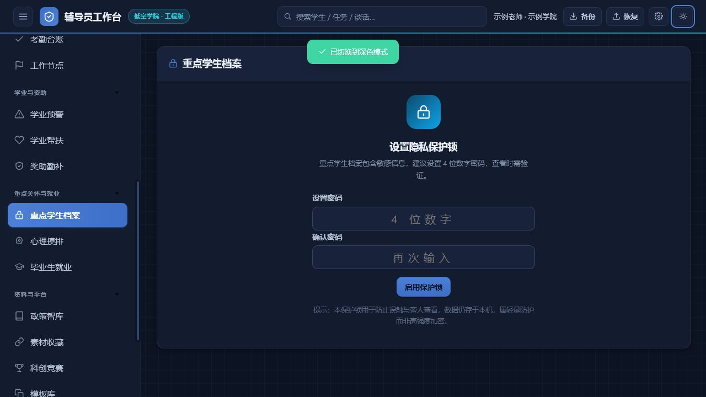

<div align="center">


# 辅导员工作台 · Counselor Desk

**为高校辅导员量身打造的本地化工作台 · 单文件 HTML · 零依赖 · 离线可用**

[使用说明](./使用说明.md) · [二次开发指南](./docs/二次开发指南.md) · [数据格式与联动约定](./docs/数据格式与联动约定.md) · [更新日志](./CHANGELOG.md) · [贡献指南](./CONTRIBUTING.md)

</div>

<div align="center">


</div>

<div align="center">

[**🌐 在线演示**](https://7752777.github.io/counselor-desk/) · [**📥 下载单文件**](./index.html) · [**📖 使用说明**](./使用说明.md) · [**⭐ Star**](https://github.com/7752777/counselor-desk/stargazers)

</div>

---

> 这是工作「台」，不是工作「平台」。
> 为每位辅导员在本机独立使用而设计，替代重型系统里"太复杂、用不顺手"的日常场景。

---

## 🎬 Banner

<div align="center">


</div>

---

## ✨ 为什么做这件事

很多高校已经有了功能完整的辅导员工作平台——多用户、多权限、安全合规。但一线老师日常只需要：

- 今天有哪些事要处理？哪些逾期了？
- 哪个学生重点关注、该几时回访了？心理危机预警谁还没解除？
- 谈了一次话，留个记录、标记要不要跟进；
- 校外住宿/走读审批、假期去向统计、评优榜样申报；
- 月底写个工作小结，能直接生成文字。

**这些事不值得登录重型系统、走完整流程。**

辅导员工作台把这些高频动作收敛到一个本地页面里，**打开就用，关掉不丢**——双击 `index.html` 就是你的一天。

---

## 🎯 核心特性

<div align="center">

| 🎨 **视觉** | 📦 **数据** | 🔌 **联动** | 🛡️ **隐私** |
| :---: | :---: | :---: | :---: |
| 设计令牌系统 | 22 个数据集合 | 交换包 v6 | localStorage 本机存储 |
| 五套配色 + 背景图 | 23 个字段同义词 | JSON 备份恢复 | 启动锁 + 敏感操作验证 |
| 24px 工程蓝图网格 | 缺值零溢出 | `CWB.bridge` API | 零外传、零后端 |
| WCAG AA 无障碍 | xls/xlsx/csv 三合一 | 字段命名对齐 | 可携带 / 可换设备 |

</div>

### 视觉

- **v3.8 低空学院·工程版**：深空航蓝 `#0b3a82` + 信号青 `#0bb4c4` 双核配色，body 叠加 24px 工程蓝图网格，KPI 卡片左侧 3px 工程色侧条，14 个模块顶部统计条一次性清爽
- **设计令牌系统**：模块化字号阶梯 / 分层阴影 / 8pt 间距 / 统一动效曲线
- **完整深色模式**：顶栏一键切换、localStorage 持久化、首次进入跟随系统偏好
- **WCAG AA 无障碍**：全局 `:focus-visible` 聚焦环 + `prefers-reduced-motion` 降级

### 数据

- **22 个数据集合**：19 个业务集合 + 学习资料 / 学习笔记 / 学习记录
- **学生大表 xls/xlsx 直传**：从学校信息化门户导出的文件直接拖入，CDN 动态加载 SheetJS，**23 个常见列名同义词模糊匹配**，缺值零溢出，重复学号合并去重
- **首次使用引导**：设置个人信息、导入学生、处理今日任务和首次备份按清单完成，可随时跳过和恢复
- **界面个性化**：五套配色预设、本地背景图、透明度调节、默认外观恢复
- **个人学习助手**：资料进度、笔记、本地摘要和学习包导出，内容不自动上传第三方
- **通用导入预览**：字段模糊匹配、导入快照、结果统计和最近导入撤销
- **CSV 闭环**：18 个业务模块支持"模板 → 导出 → 改 → 导回"，导出与导入使用同一套表头
- **JSON 备份恢复**：一键导出全量数据（含个人设置），换电脑后一键还原

### 联动

- **交换包 v6**：覆盖业务集合、个人设置和学习资料，兼容 v1–v5
- **API 预留**：`CWB.bridge.request()` / `pullTasks()` / `pushSummary()` 已留好接口
- **未来**：工作台已具备 API 直连能力，只需在重型平台侧开通即可

### 隐私

- **零后端**：所有数据在浏览器 `localStorage`，命名空间 `cwb_v1_`
- **零外传**：不上传任何服务器，断网可用
- **可携带**：U 盘、邮件附件、手机互传都行
- **登录锁与敏感操作保护**：启动锁、手动上锁、删除/清空等操作二次验证；这是界面访问控制，不等同于数据加密

---

## 📸 截图

<div align="center">

### 首页 · 今日概览


### 学生工作台 · 列表视图


### 工作日历与节点


### 重点学生档案（隐私锁）


### 深色模式



</div>

---

## 🚀 30 秒上手

无需安装、无需构建、无需联网。

```bash
# 1. 克隆仓库
git clone https://github.com/7752777/counselor-desk.git

# 2. 打开单文件
open index.html        # macOS
xdg-open index.html    # Linux
start index.html       # Windows
```

或者更简单：

1. 把 `index.html` 拷到任意位置（U 盘、桌面、手机传自己都行）；
2. 双击用浏览器打开即可；
3. 首次打开会自动载入示例数据，方便立刻看到效果；
4. 进入「联动 → 危险操作区」可清空示例数据，开始录入真实数据。

**手机上使用**：用手机浏览器打开后，点"分享 → 添加到主屏幕"，它就变成一个像 App 一样的图标，离线也能用。

---

## 🏗️ 架构

整个应用通过全局对象 **`window.CWB`** 暴露扩展点——老师可以用 AI 在本地给工作台加一个「请假审批」「宿舍检查」之类的新模块，不必动核心代码。

```javascript
// 在浏览器控制台试试
CWB.version                              // "3.9.0"
CWB.db.students                          // 学生数组
CWB.db.stay                              // 走读数组
CWB.db.leave                             // 去向数组
CWB.db.honor                             // 评优数组
CWB.db.pleave                            // 请销假数组
CWB.db.attend                            // 考勤数组
CWB.db.warn                              // 学业预警数组
CWB.db.policy                            // 政策智库数组
CWB.db.comp                              // 科创竞赛数组
CWB.consts.HONOR_TYPES                   // 评优类型常量
CWB.consts.POLITICS                      // 政治面貌常量
CWB.consts.COMP_CATS                     // 科创竞赛 7 类常量
CWB.modules.register({                   // 注册自定义模块
  key: 'dorm-check',
  name: '宿舍检查',
  duty: 'daily',
  icon: 'home',
  render: () => '<div>我的自定义模块</div>'
})
```

### 核心扩展点

| 扩展点 | 用途 |
| --- | --- |
| `CWB.store` | 数据读写层（localStorage 封装） |
| `CWB.schema` | 实体字段定义（可加本地字段） |
| `CWB.ui` | 弹窗 / 表单 / 提示组件 |
| `CWB.hooks` | 事件钩子（`store:write` / `view:render` / `module:register`） |
| `CWB.bridge` | 联动桥（交换包 v6、API 预留） |
| `CWB.modules.register(def)` | **注册自定义模块**，自动插入导航 |
| `CWB.norm` | 数据规范化函数（含学习助手） |

详见 [**《二次开发指南》**](./docs/二次开发指南.md)。

---

## 📁 项目结构

```
counselor-desk/
├── index.html                    # 全部功能（零外部依赖，单文件 ~6000 行）
├── README.md                     # 本文件
├── CHANGELOG.md                  # 完整版本历史
├── CONTRIBUTING.md               # 贡献指南
├── LICENSE                       # MIT
├── 使用说明.md                    # 面向辅导员的使用说明
├── assets/                       # 视觉资产
│   ├── banner.svg                # 仓库 Banner
│   ├── logo.svg                  # 项目 Logo
│   └── screenshots/              # 截图
├── docs/                         # 开发者文档
│   ├── 辅导员工作台使用手册.md    # v3.9 首次使用与日常操作手册
│   ├── 使用指南.md                # 各模块怎么用（v3.9.0）
│   ├── 二次开发指南.md             # window.CWB 扩展点详解 + 示例
│   └── 数据格式与联动约定.md        # 字段、交换包 v6、CSV、接口约定
├── package.json                  # 测试脚本与开发依赖
├── pnpm-lock.yaml                # 测试依赖锁定文件
├── scripts/                      # 语法与公开发布检查
├── .github/workflows/            # 测试、Lint、Pages 发布
├── tests/                        # 本地测试（需 jsdom，6 套全 PASS）
│   ├── regression.js             # 回归测试：22 视图渲染 + Phase A/B/C 关键特性
│   ├── import-loop.js            # 导入/导出闭环：18 模块 CSV 往返 + JSON 备份恢复
│   ├── crud-smoke.js             # 全模块增删改冒烟
│   ├── student-import.js         # 学生大表导入：列名匹配 / 缺值容错 / 合并契约
│   ├── demo-recovery.js          # 示例数据清理与恢复
│   └── v39-features.js           # v3.9 引导 / 外观 / 安全 / 学习助手 / 导入预览
└── .gitignore
```

---

## 🧪 测试

六套本地测试，全部 PASS ✅

```bash
pnpm install --frozen-lockfile
pnpm test                         # 六套测试
pnpm run lint                     # 内联 JavaScript 语法检查
pnpm run check:public             # 公开发布面检查
```

测试仅依赖 [jsdom](https://github.com/jsdom/jsdom)，无需浏览器；日常使用不需要安装任何依赖。Excel 导入会按需从 SheetJS CDN 加载解析器，离线时可使用 CSV 导入。

```bash
pnpm install --frozen-lockfile
```

---

## 🎓 设计依据

依据《普通高等学校辅导员队伍建设规定》（教育部 43 号令）第五条，辅导员有九项工作职责。工作台以这九项为底色调色板与工作量统计维度：

| 代号 | 职责 | 简称 | 主色 |
| --- | --- | --- | --- |
| `ideology` | 思想理论教育和价值引领 | 思政引领 | 红 |
| `party` | 党团和班级建设 | 党团班级 | 玫红 |
| `study` | 学风建设 | 学风建设 | 蓝 |
| `daily` | 学生日常事务管理 | 日常事务 | 青 |
| `psych` | 心理健康教育与咨询 | 心理健康 | 绿 |
| `net` | 网络思想政治教育 | 网络思政 | 紫 |
| `crisis` | 校园危机事件应对 | 危机应对 | 橙 |
| `career` | 职业规划与就业创业指导 | 就业指导 | 琥珀 |
| `research` | 理论和实践研究 | 理论研究 | 灰 |

---

## 🤝 与重型「办公网站」平台的关系

| 维度 | 重型平台（办公网站） | 本工作台 |
| --- | --- | --- |
| 部署 | 自有服务器，Next.js + PostgreSQL | 单文件 HTML，本地浏览器 |
| 用户 | 多用户、多角色、权限体系 | 单辅导员本机自用 |
| 数据 | 入库、集中管理 | `localStorage`，仅本机 |
| 定位 | 管理 / 统计 / 合规 | 个人日常提效 |

**隔离原则**：
- 本工作台在完全独立的目录 `counselor-desk/`，独立的 git 仓库；
- **不修改、不依赖**原"办公网站"项目任何文件；
- 字段命名刻意与原平台对齐（见《数据格式与联动约定》），为将来联动留口子；
- 联动现阶段用「文件交换包（JSON）」即可，API 直连通道已预留接口。

---

## 📊 数据说明（隐私）

- 所有数据存在浏览器 `localStorage`，命名空间 `cwb_v1_`；
- **不上传任何服务器**，断网可用；
- **Excel 导入例外**：只有 xls/xlsx 直传会按需加载 SheetJS CDN；CSV、JSON 备份和已保存的本地数据不依赖后端；
- 首屏提供「导出 JSON 备份 / 导入恢复」，建议定期导出；
- 数据积累到 30 条会有温和备份提示；
- 导出可带走、可迁移、可换设备；
- **每个业务模块现在都能 CSV 导入了**：模块工具栏新增「模板」和「导入 CSV」按钮。先点「模板」下载该模块带表头的 Excel（CSV），按格式填好，再点「导入 CSV」原样导回；导出与导入使用同一套表头，来回不丢字段；
- 各模块均支持 CSV 导出（带 BOM，Excel 直接打开）。

---

## 📜 术语与字段对照（v2.1.0 校准版）

以下术语已参照本院真实工作文件校准：

| 工作台字段 | 对应真实表格 | 来源文件 |
| --- | --- | --- |
| 学生当前状态（在读/休学/复学/退学/毕业/结业） | 成绩表 · 学生当前状态列 | 成绩表 |
| 政治面貌（中共党员/预备党员/入党积极分子/共青团员/群众/其他） | 青春榜样汇总 · 政治面貌列 | 五四评比/青春榜样 |
| 危机预警级别（校级/院级） | 心理危机预警库分级名单 · 级别列 | 心理危机预警库 |
| 危机发现方式（自我报告/普查发现/其他人发现） | 心理危机预警库 · 发现方式列 | 心理危机预警库 |
| 是否解除危机预警 | 心理危机预警库 · 是否解除列 | 心理危机预警库 |
| 申请类型（低空先锋/德育/智育/体育/美育/劳育之星） | 青春榜样汇总 · 申请类型列 | 青春榜样/五四评比 |
| 审批状态（审批通过/审批中/待审批/未通过） | 校外住宿信息汇总表 · 系统审批情况 | 校外住宿 |
| 学生类型（本科生/研究生） | 校外住宿信息汇总表 · 学生类型 | 校外住宿 |
| 家长知情同意书 | 暑假学生去向统计表 | 假期去向 |

---

## 🤝 贡献

欢迎 fork 后按本校实际场景改造。

- 仓库与"办公网站"重型平台**完全隔离**，互不干扰；
- 改造后若愿意回馈，欢迎提 PR；
- 因数据存本地，**请勿把含真实学生信息的导出文件提交到公开仓库**。

详细贡献流程见 [**CONTRIBUTING.md**](./CONTRIBUTING.md)。

---

## 📜 开源协议

本项目以 [MIT](./LICENSE) 协议开源。

---

## 🗺️ 版本历史

| 版本 | 说明 |
| --- | --- |
| **v3.8.0** | 「低空学院·工程版」视觉重塑 + 字号放大 + 学生大表 xls/xlsx 直传：主色从晴空蓝升级为**深空航蓝 (#0b3a82) + 信号青 (#0bb4c4)**双核配色，body 叠加 24px 工程蓝图网格；KPI 卡片字号整体放大（label 12→13.5px / value 28→30px / sub 11.5→12.5px）并改用左侧 3px 工程色侧条；14 个模块顶部统计条一次性清爽；学生初始化新增 **xls/xlsx 三合一导入器**（CDN 动态加载 SheetJS、23 个常见列名同义词模糊匹配、缺省值零溢出、重复学号合并去重、新值补齐旧值、空值不覆盖）；新增第 4 套测试 `student-import.js` 覆盖列名匹配 / 容错 / 合并契约 |
| **v3.7.0** | 整体 UI「亮堂化」升级：导航栏与顶栏由黑底白字改为**浅色通透外壳**（选中项 accent 药丸高亮）；主色由深邃蓝改为**晴空蓝**；字号整体放大（正文 14→15px、标题阶梯上抬）；表面更亮、圆角更圆润、阴影更轻；深色模式从纯黑改为**柔和暗色（comfort-dim，蓝调炭灰）**，夜里不刺眼不压抑 |
| **v3.6.0** | 视觉与交互整体升级：重构设计令牌（模块化字号阶梯 / 深邃品牌蓝 / 分层阴影 / 8pt 间距 / 统一动效曲线）；完整深色模式（浅深一键切换、localStorage 持久化、首次进入跟随系统）；按钮 / 输入框 / 卡片 / 表格 / 空状态精修；全局 :focus-visible 聚焦环与 prefers-reduced-motion 无障碍；弹窗与提示更顺滑的入场动效 |
| **v3.5.0** | 数据闭环：18 个业务模块补齐 CSV 导入 + 模板下载（导出的文件可原样导回）；JSON 备份恢复现一并还原个人设置（辅导员姓名 / 学院 / 隐私锁）；新增 3 套本地测试（回归 / 导入导出闭环 / 全模块增删改） |
| **v3.4.0** | 信息获取与报表深化：顶栏全局搜索（跨 8 类数据）、首页趋势折线图 + KPI 环比、侧栏分组折叠 / 常用钉住、按钮微交互、任务批量操作、占比环形图（学生关注结构 / 预警等级）、首页数据洞察卡（逾期率 / 谈话覆盖率 / 重点关注占比）、周报 / 月报一键导出 |
| **v3.3.0** | 易用与便携：清理界面内部开发描述、新增「数据存储与备份」卡片、一键生成自带数据的便携工作台、首用示例数据提示、配套《使用说明》 |
| **v3.2.0** | 克制高级感 UI 重设计：纯色深蓝导航 + 纯白卡片 + 单一主色 + 极细边框（Linear / Vercel 风），去除渐变滥用 / 玻璃拟态 / 发光 |
| **v3.1.0** | 视觉重做：航空蓝玻璃拟态风格，深色顶栏 / 导航、玻璃卡片、KPI 升级、装饰背景、全局精致化 |
| **v3.0.0** | 航空工科蓝配色大改 + 四期迭代补齐 13 个新模块；交换包升级至 v5；首页聚合竞赛截止提醒；`boot()` 数据读回缺陷修复 |
| **v2.2.0** | 视觉大升级——移除死板文字、全面美化 UI（渐变 KPI 数字、微妙渐变标签/药丸、悬浮阴影过渡、统一缓动曲线） |
| **v2.1.0** | 新增三大专项模块（校外住宿/假期去向/评优榜样）、心理危机预警增强、术语校准、移动端抽屉导航 |
| **v1.0.0** | 首版发布——六大基础视图、43 号令九职责、localStorage 持久化、CSV 导入导出、交换包联动桥 |

完整更新日志见 [**CHANGELOG.md**](./CHANGELOG.md)。

---

<div align="center">

**为一线辅导员而生 · 让重复的事变简单**

[⬆ 回到顶部](#辅导员工作台--counselor-desk)

</div>
