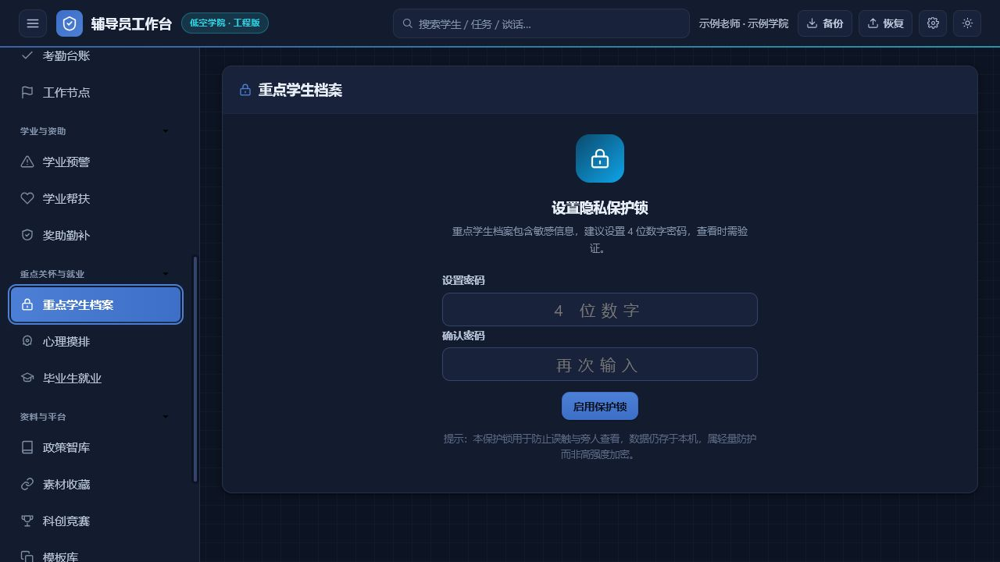
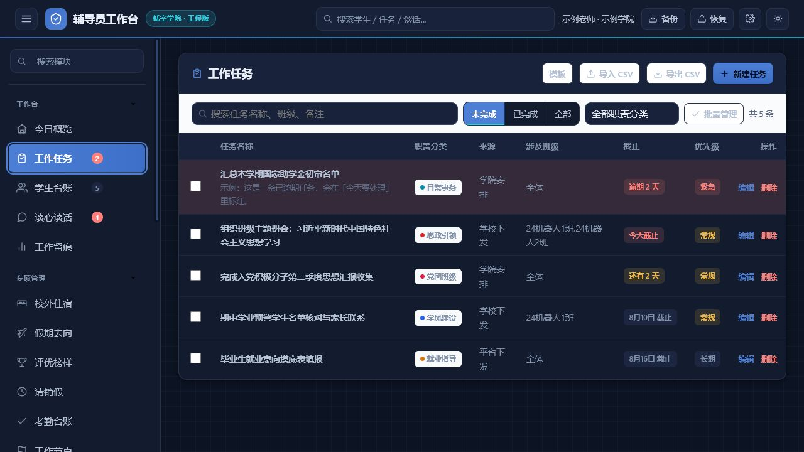

<div align="center">


# 辅导员工作台 · Counselor Desk

**给高校辅导员的本地优先工作台**

把学生台账、重点关注、谈心谈话、工作留痕、导入、备份和学习资料，收拢到一个打开就能工作的页面里。

[](./CHANGELOG.md)
[](./docs/v4-privacy.md)
[](./LICENSE)
[](./docs/v4-acceptance-report.md)

<br />

[立即体验网页版](./index.html) · [查看使用手册](./docs/辅导员工作台使用手册.md) · [阅读 v4.0 验收记录](./docs/v4-acceptance-report.md) · [提交 Issue](https://github.com/7752777/counselor-desk/issues)

</div>

<p align="center">
  
</p>

> 这不是一个试图替代学校正式业务系统的“大平台”。它更像辅导员自己的数字工作桌：打开、接上今天的工作、记下学生的变化，然后安心地把数据留在自己的设备里。

## 为什么做它？

一线工作经常不是缺少系统，而是信息散落在 Excel、聊天记录、临时表格和多个业务入口之间：

- 今天有哪些事要处理？哪些任务已经逾期？
- 哪些学生需要回访，哪些谈话还没有留下记录？
- 学校导出的表头和系统模板不一致，怎样安全导入？
- 换电脑、重装系统或交接工作时，怎样把台账和附件完整带走？

辅导员工作台只做一件事：让这些高频、连续、需要回看的工作，在本地形成一条清晰的记录链。

## 先看一眼

| 首页与待办 | 学生台账 | 工作留痕 |
| --- | --- | --- |
|  |  |  |

| 重点学生 | 平台联动 | 工作任务 |
| --- | --- | --- |
|  |  |  |

## v4.0 有什么变化？

### 学生台账变成一个小工作区

学生模块内部提供三个标签，不再把照片、分析和学生列表拆成突兀的独立入口：

- **台账视图**：表格、信息卡片、照片花名册三种展示方式。
- **照片管理**：文件夹、ZIP、批量文件和单人补传；重名、无匹配和多匹配进入人工确认队列。
- **数据分析**：班级、宿舍、楼栋和趋势视图；点击图表只更新筛选条件，并回到学生明细。

### 桌面版和网页版各司其职

| 形态 | 适合场景 | 数据底座 |
| --- | --- | --- |
| **Windows 桌面版** | 日常主工作台、照片附件、自动备份 | Electron + SQLite + 本地加密附件保险库 |
| **单 HTML 网页版** | 双击即用、移动查看、轻量离线兼容 | IndexedDB；不承诺指定文件夹定时写入 |

两端复用同一套无框架 TypeScript 业务核心，不建设账号、云同步、服务器端学生数据库或自动联网就业抓取。

### 导入不再是“选文件然后祈祷”

学生 Excel/CSV 导入按“识别 → 映射 → 预览 → 校验 → 分段写入 → 原子提交”执行：

- 支持 30+ 个标准字段，未知列保留为带类型和敏感级别的自定义字段。
- 默认 500 行一段，记录文件哈希、表头行、映射版本和最后处理行。
- 取消、崩溃、断电或文件变化，都不会留下半批正式数据。
- 学号按文本处理，公式注入、乱码、重复学号和缺失关键字段会明确提示。

### 数据可以带走，也可以回退

交换包升级到 v7，支持旧版 JSON、v1–v6 包和便携 HTML 迁移。桌面版使用加密备份容器保存数据库、照片和附件；网页版提供手动加密备份。

## 30 秒开始使用

### 直接体验网页版

1. 下载仓库中的 [`index.html`](./index.html)，或使用在线演示。
2. 用 Chrome、Edge 或 Firefox 打开。
3. 首次使用选择“体验示例”“正式初始化”或“从备份恢复”。
4. 正式导入前，先用脱敏样表走一遍预览与校验流程。

### 构建 Windows 桌面版

需要 Node.js 20+、pnpm 和 Windows 环境：

```powershell
pnpm install --frozen-lockfile
pnpm run desktop:dev
pnpm run desktop:build
```

构建脚本和发布说明见 [`docs/v4-release-signing.md`](./docs/v4-release-signing.md)。

## 关于“代码签名证书”

这句话的意思很简单：**程序能运行，不等于 Windows 已经确认“这个安装包是谁发布的”。**

没有签名时，Windows SmartScreen 可能显示“未知发布者”并要求用户额外确认。这不代表程序一定有问题，只代表安装包没有经过发布者身份签名。因此当前仓库可以生成内部测试包，但不会把未签名安装包标成正式公开发布版。

正式发布通常需要：

1. 从可信 CA 购买组织代码签名证书，导出为受保护的 `.p12`/`.pfx` 文件。
2. 只在发布机或 CI 的安全密钥库中保存证书和密码，绝不提交 Git 仓库。
3. 构建前配置 Electron Builder 环境变量：

   ```powershell
   $env:CSC_LINK = 'C:\secure\counselor-desk-code-signing.p12'
   $env:CSC_KEY_PASSWORD = '只在当前终端临时设置的证书密码'
   pnpm run desktop:build
   ```

4. 构建后执行签名检查，确认 `.exe`、`.msi` 或 `.appx` 的 Authenticode 状态为 `Valid`。

证书不是开发者必须马上购买的东西。你现在可以继续用未签名包做本机测试；等准备对外发布时，再单独完成证书采购、密钥保管和签名流水线。

## 版本历史

| 版本 | 主题 | 记录 |
| --- | --- | --- |
| **v4.0** | 双形态本地优先底座、照片与附件、分段导入、组织/党员/文件/就业模块归位 | [`v4.0 验收报告`](./docs/v4-acceptance-report.md) |
| **v3.9** | 全国高校表头兼容、统一导入闭环、重点档案、备份恢复和本地学习助手 | [`v3.9 迭代记录`](./docs/迭代记录/2026-08-v3.9.md) |
| **v3.8** | 低空学院工程版视觉重塑、学生大表直传和导入安全加固 | [`CHANGELOG`](./CHANGELOG.md) |
| **v1–v3** | 从单文件台账到 19 个业务集合的本地工作台 | [`历史说明`](./docs/迭代记录) |

想了解这个项目为什么坚持本地优先，可以读 [`ADR-006：双运行时与本地保险库`](./docs/decisions/ADR-006-v40-dual-runtime-and-vault.md)。

## 安全边界

- 学生证件、联系方式、家庭住址、心理、政治面貌和照片按敏感个人信息处理。
- 不采集人脸特征，不生成生物特征向量，不做任意照片相似匹配。
- 不自动联网抓取就业信息，不把第三方页面内容写入学生档案。
- 备份口令无法找回；恢复前必须验证口令、格式、完整性和附件内容。
- 请勿把真实身份证号、家庭住址或家长电话上传到公共 Issue、截图或演示站点。

完整说明见 [`隐私说明`](./docs/v4-privacy.md) 和 [`迁移与备份指南`](./docs/v4-migration-and-backup.md)。

## 开发、测试与贡献

```powershell
pnpm test
pnpm run lint
pnpm run check:public
pnpm run report:imports
```

提交 Issue 时，请说明浏览器/Windows 版本、文件类型、可脱敏复现步骤和预期结果。不要上传真实学生数据。

- [二次开发指南](./docs/二次开发指南.md)
- [数据格式与联动约定](./docs/数据格式与联动约定.md)
- [贡献指南](./CONTRIBUTING.md)
- [安全说明](./SECURITY.md)
- [MIT License](./LICENSE)

<div align="center">

**如果它帮你少整理一张表、少漏掉一次回访，欢迎给项目点一个 Star。**

</div>
