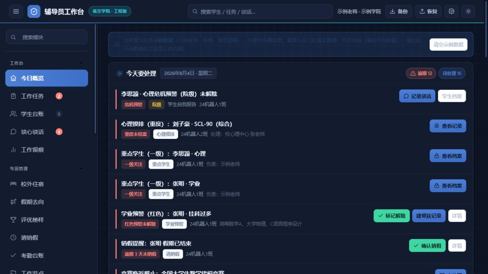
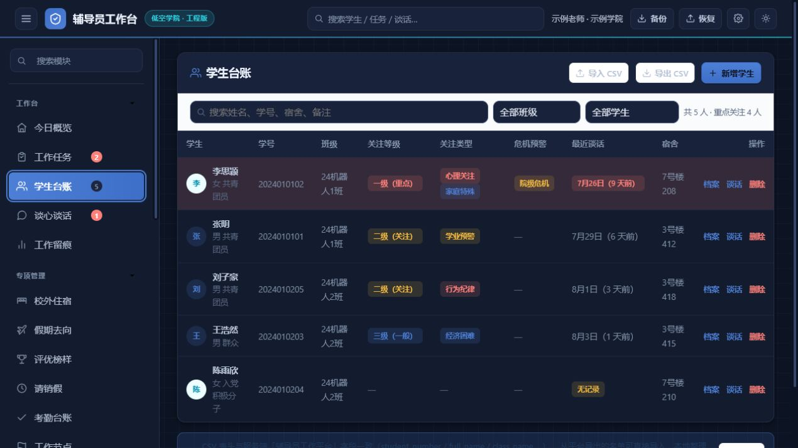
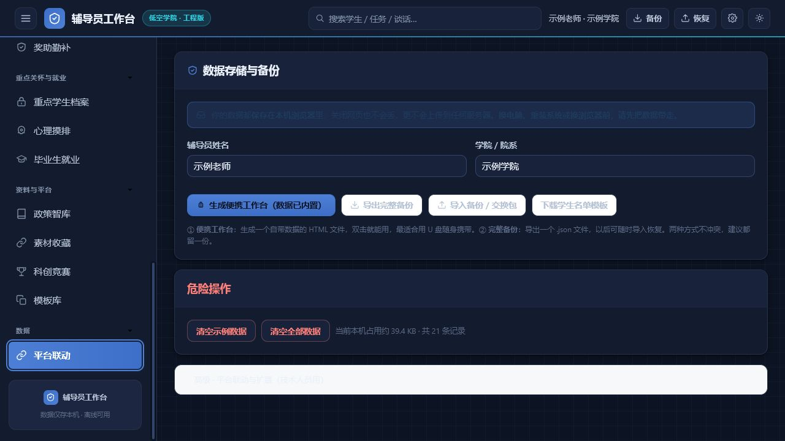
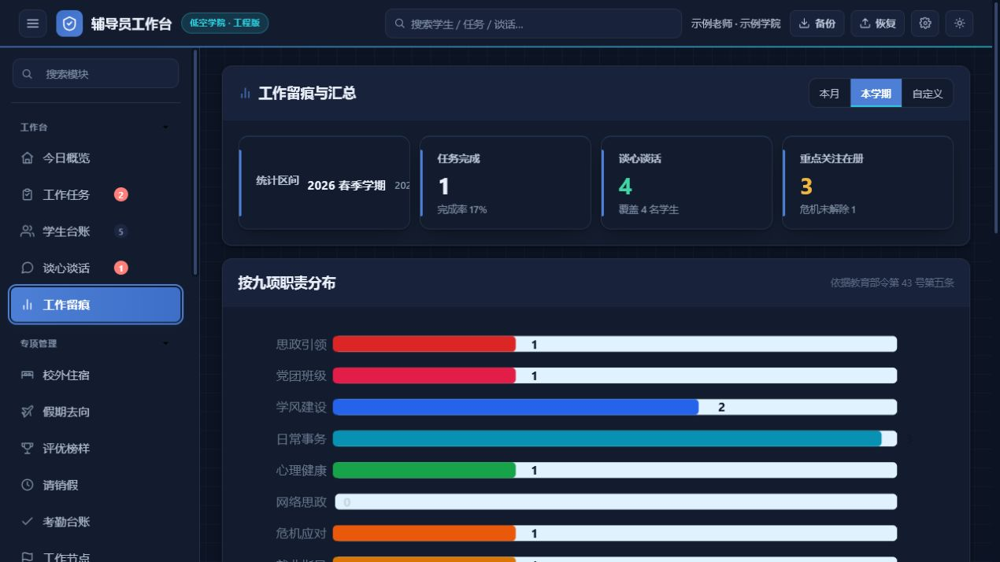
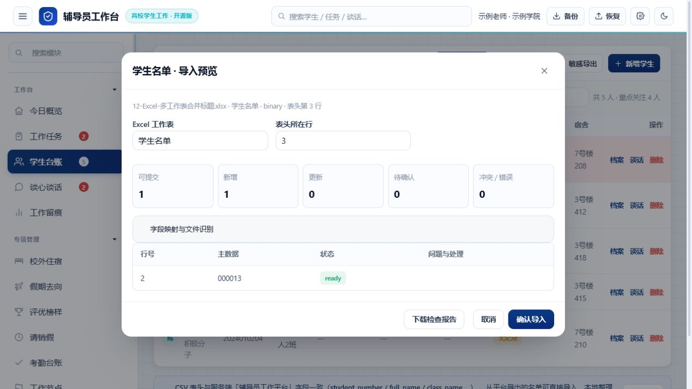
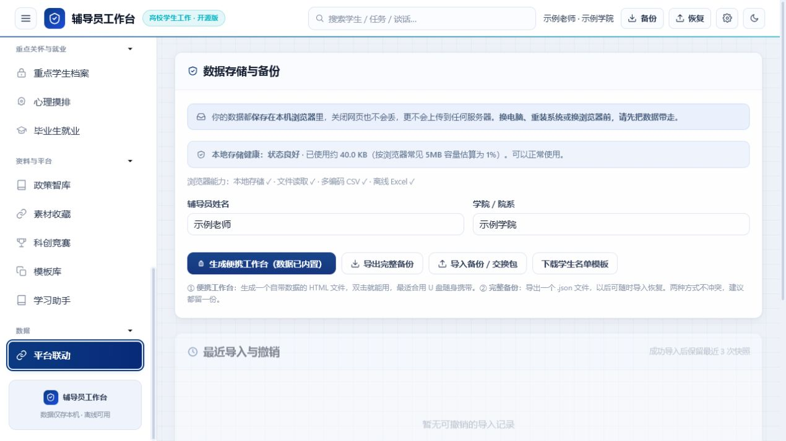

<div align="center">


# 辅导员工作台 · Counselor Desk

### 给高校辅导员的一张本地数字工作桌

把学生台账、谈心谈话、重点关注、工作留痕、资料库、就业资源和备份迁移，收进一个打开就能继续工作的地方。

[](./CHANGELOG.md)
[](./docs/v4-migration-and-backup.md)
[](./index.html)
[](./docs/v4-migration-and-backup.md)
[](./docs/v4-privacy.md)
[](./docs/v4-acceptance-report.md)
[](./LICENSE)

<br />

[立即体验网页版](./index.html) · [Windows 使用指南](./docs/v4-migration-and-backup.md) · [使用手册](./使用说明.md) · [提交建议](https://github.com/7752777/counselor-desk/issues) · [给项目点 Star](https://github.com/7752777/counselor-desk)

</div>

<p align="center">
  
</p>

> 这不是要替代学校正式业务系统的“大平台”。它更像辅导员自己的工作桌：今天要回访谁、哪张表要交、哪条记录还没补、下次换电脑如何带走数据，都能在一个本地窗口里找到答案。

## 先解决每天最烦的四件事

很多日常工作并不难，难的是它们被拆散在 Excel、群文件、浏览器收藏夹、聊天记录和临时文件夹里：

- 学校每次导出的学生表头都不一样，导入前还要手工改列名。
- 假期去向表、德育考核表、宿舍异动表和安全通知散落在不同文件夹，急用时找不到。
- 学生照片、学号、宿舍、谈话记录和重点关注信息不能放在同一个清楚的档案里。
- 想用手机临时改几条数据，或清空工作区做演示，又担心原始状态回不来。

辅导员工作台 v4.0 围绕这些高频堵点做了本地化整理：少切窗口，少重复录入，数据始终能导出、回退和带走。

## 打开后可以直接做什么？

| 工作场景 | 直接可用的能力 |
| --- | --- |
| 学生台账 | 导入 Excel/CSV；未知表头保留为自定义字段；表格、卡片、照片花名册三种视图切换。 |
| 培养层次 | 本科与研究生同时管理；同一学号、同一年份也按培养层次分别识别，不会互相覆盖。 |
| 灵活筛选 | 按学号、姓名、班级、培养层次、生源地、宿舍、成绩或任意导入字段筛选和排序。 |
| 照片管理 | 文件夹、ZIP、批量文件和单人补传；按学号或唯一姓名归档；无法确认的照片进入人工队列。 |
| 工作留痕 | 谈心谈话、学业预警、重点学生、班团组织、党员发展和工作节点集中维护。 |
| 文件资料库 | 归档通知、表单、政策文件、讲话稿和工作材料；支持搜索、下载、版本回退和本地附件。 |
| 政策知识库 | 记录来源、文号、关键词和摘要；网页链接可直接打开，也可以上传本地 PDF、Word、表格等文件。 |
| 就业资源 | 离线保存经核验的官方就业平台，按地区和行业筛选，不自动抓取第三方页面。 |
| 换机与备份 | 导出换机包；手机端打开网页后增删改；桌面端预览差异，再选择合并或覆盖。 |

## 手机可以参与工作，但不需要云账号

手机往返采用“文件交换”方式，适合临时外出、走访和现场补录。它不是云端实时同步：数据包由你自己保存、传递和导入，桌面端始终是可控的主工作区。

1. 桌面端进入“备份与迁移”，导出手机工作包。
2. 把 JSON 文件传到手机，手机浏览器打开仓库里的 `index.html`，导入后即可查看、增加、修改和删除记录。
3. 手机端导出回传包，再传回桌面电脑。
4. 桌面端先看新增、更新、删除数量，再选择“合并并同步”或“覆盖并同步”；操作前会自动保存回退快照。

详细步骤见[迁移与备份说明](./docs/v4-migration-and-backup.md)。

## 样例 A/B：放心试导入，也能完整还原

需要演示或测试新表格时，可以把当前工作区保存为“样例 A”，然后清空工作区导入“样例 B”。测试结束后，从快照恢复样例 A，学生、工作记录、文件目录和本地附件一起回到原状态。

这条流程适合：

- 试验新的 Excel 表头和字段映射；
- 给同事演示一个干净的工作区；
- 验证手机回传包的合并、覆盖和删除行为；
- 更换电脑前先做一次可验证的迁移演练。

## v4.0 的关键改进

- **动态字段**：标准字段、学校自定义字段和未知字段都会进入档案，表格列按实际数据生成。
- **数据可带走**：网页版使用浏览器本地存储；Windows 桌面版可把数据库、文件目录和附件一起备份。
- **照片只做归档**：按学号或唯一姓名匹配，不采集人脸特征，不生成生物特征向量。
- **手机回传可审阅**：先看差异再写入，合并保留桌面端其他记录，覆盖才会镜像手机端删除。
- **工作数据有退路**：清空、恢复、覆盖和迁移前都可以生成快照，便于反复试验。

## 截图一览

<p align="center">
  
  
</p>
<p align="center">
  
  
</p>
<p align="center">
  
  
</p>

截图均使用示例或脱敏数据，不包含真实学生信息。

## 桌面版与网页版

| 版本 | 适合场景 | 数据方式 |
| --- | --- | --- |
| **Windows 桌面版** | 日常主工作区、照片和本地附件、完整备份迁移 | Electron + SQLite + 本地附件保险库 |
| **单 HTML 网页版** | 双击即用、手机临时查看和录入、轻量离线场景 | 浏览器 IndexedDB + 文件交换包 |

两端复用同一套业务数据结构。当前版本不包含账号体系、云端实时同步、远程审批或自动抓取第三方就业内容；这些边界是为了让数据去向清楚、部署成本可控。

## 隐私边界

- 默认不要求账号，不把学生档案上传到项目服务器。
- 桌面版的照片和其他附件保存在本机附件库；导出、导入和删除操作会给出明确提示。
- 心理健康、政治面貌、照片和备份属于敏感信息，请按学校制度设置电脑权限并妥善保管导出文件。
- 项目不做人脸识别；照片匹配只使用学号、唯一姓名和人工确认。

详见[隐私说明](./docs/v4-privacy.md)和[验收报告](./docs/v4-acceptance-report.md)。

## 版本故事

| 版本 | 重点变化 |
| --- | --- |
| **v1.0** | 学生台账、CSV 导入导出和本地保存，打开文件即可工作。 |
| **v2.0** | 统一视觉、移动端导航和高频业务模块，工作台开始形成完整工具链。 |
| **v3.0** | 补齐 19 个业务模块、数据联动和报表汇总。 |
| **v3.8** | 强化大表导入、字段匹配、缺失值处理和回归测试。 |
| **v4.0** | 双形态运行、动态字段、文件资料库、就业资源、手机文件交换和样例快照。 |

## 30 秒开始使用

1. 直接打开仓库里的 [`index.html`](./index.html)。
2. 首次启动选择“体验示例”或“正式初始化”。
3. 在“学生台账”导入脱敏 Excel/CSV，先看预览和字段映射，再确认写入。
4. 在“文件资料库”或“政策知识库”上传本地材料，网页链接可以直接打开。
5. 正式工作前，在“备份与迁移”生成一份可恢复的快照或备份包。

## 开发者入口

```powershell
pnpm install --frozen-lockfile
pnpm test
pnpm run lint
pnpm run check:public
```

更多数据字段、扩展模块和测试约定见[二次开发指南](./docs/二次开发指南.md)、[数据格式与联动约定](./docs/数据格式与联动约定.md)和[贡献指南](./CONTRIBUTING.md)。

## 参与项目

欢迎提交脱敏后的表格格式、真实工作场景和更顺手的交互建议。提交 Issue 时请说明浏览器或 Windows 版本、文件类型、可脱敏复现步骤和期望结果，不要上传学号、住址、家长电话或真实照片。

<div align="center">

如果它帮你少翻一次群文件、少重复整理一张表，欢迎给项目点一个 Star。

</div>
